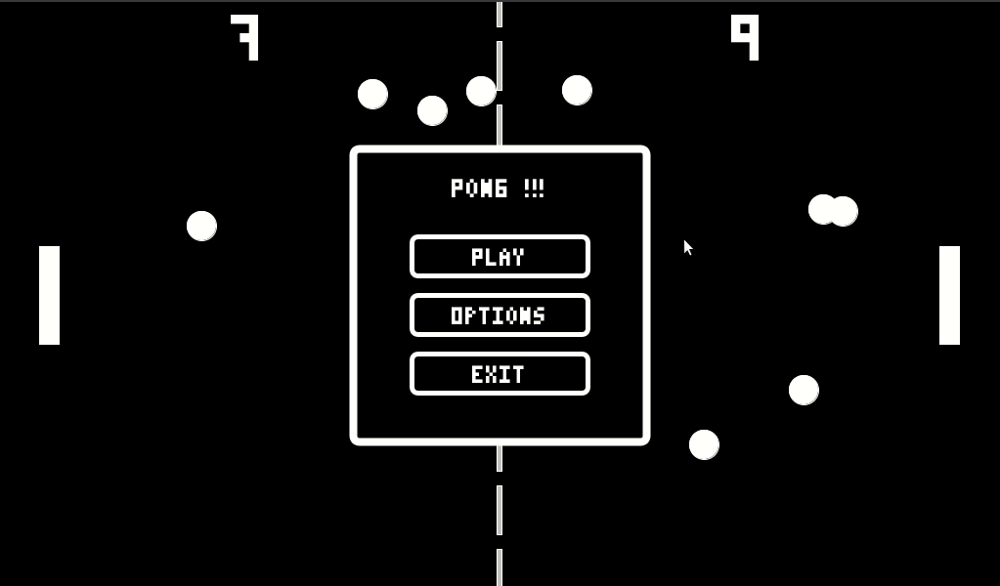

## Sobre el autor

Mi nombre es Miguel Lincoln Capote Pratts, estudiante de la Universidad de las Las
 Palmas de Gran Canarias y tengo interés en el desarrollo web y la inteligencia artificial.

## Desarrollo de Pong

En este repositorio se ha realizado en clásico juego **PONG** con la herramienta processing. Se desarrollo el juego básico, así como un modo de juego extra donde se juega con varias pelotas en ves de una. Se Añadieron menús para controlar el flujo de la aplicación. También se añadieron opciones para dar un poco de control al usuario sobre la aplicación. Se añadió musica hacer más ameno el juego solo que esto ralentizó la carga inicial del juego.

## Problemas con colisiones

Las colisiones tienen problemas cuando aumenta mucho la velocidad por ello sé todo la decición de añadir un offset a los objetos par
a que sean capaces de colisionar.

## Referencias y Librerías utilizadas

Se desarrollo utilizando como referencia la página oficial de processing y como librería externa se utilizó sound para poder reproducir la musica.

